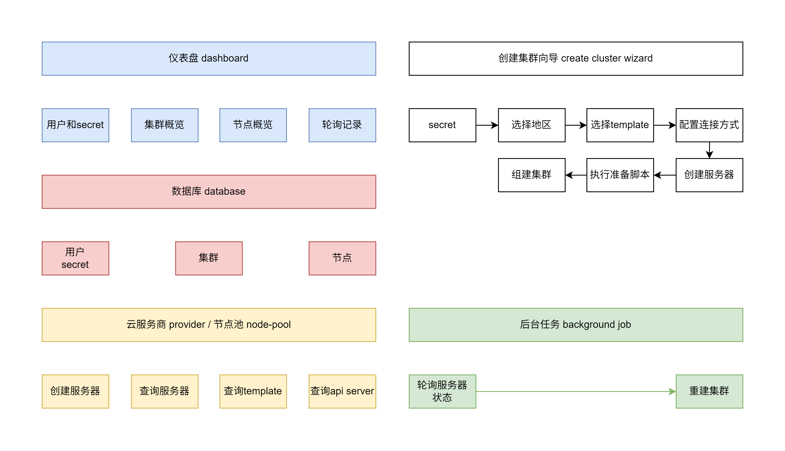

# Kube Node Pool

在腾讯云上维护竞价实例节点池并建立集群。

功能如下

## 包管理

使用pnpm，如果有需要构建的包，把它添加到 package.json 中的 `pnpm.onlyBuiltDependencies` 字段

## 数据库

1. 数据库使用 drizzle + SQLite
2. user 用户表，每个用户需要明文存储账号密码，以及腾讯云的secretID和secretKey；
3. cluster 集群表，字段包括 名称、备注、期望节点数、实际节点数
4. node 节点表，字段包括 名称、ip、所属集群、身份(控制面或工作节点)
5. polling 轮询记录表，字段包括：查询时间、查询的节点、查询结果

## 节点池

节点池的模块结构如下：
- nodePool               节点池模块
  - providers/tencent/      腾讯云节点池
    - signedClient/         签名客户端，用于发起请求
    - ...                   腾讯云其他API
    - index                 导出腾讯云节点池
  - interface               节点池接口
  - index                   导出接口和腾讯云实现

节点池模块可以有多个 providers 实现，但是使用同一个接口，并且该模块会导出接口和所有的实现。

接口内容主要包括：
1. 配置性的：设置secrets
2. 功能性的：创建服务器、查询服务器状态、查询可用的template、查询api server状态。