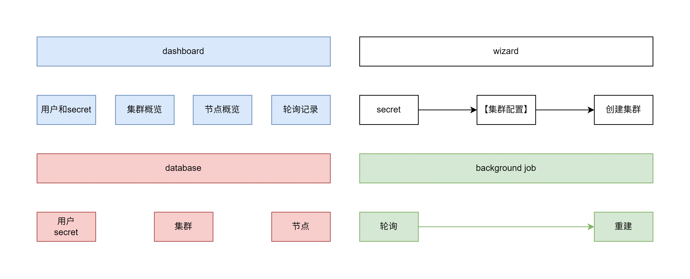

# Kube Node Pool

在腾讯云上维护竞价实例节点池并建立集群。

功能如下

## 数据库

1. 数据库使用 drizzle + SQLite
2. user 用户表，每个用户需要明文存储账号密码，以及腾讯云的secretID和secretKey；
3. cluster 集群表，字段包括 名称、备注、期望节点数、实际节点数
4. node 节点表，字段包括 名称、ip、所属集群、身份(控制面或工作节点)、
5. polling 轮询记录表，字段包括：查询时间、查询的节点、查询结果