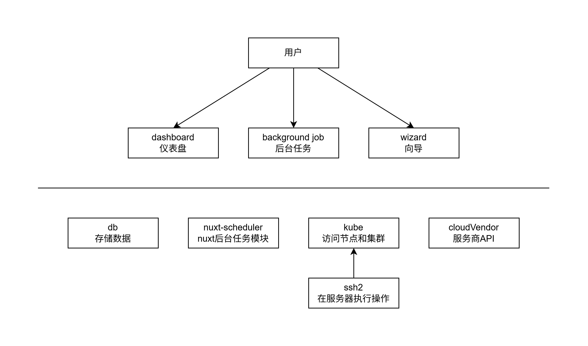

# 开发者文档

项目使用 nuxt4 开发，AI 要注意[nuxt4 的文件结构](https://nuxt.com/docs/4.x/directory-structure)和 nuxt3 有所不同，尤其是app目录。

## 文档和绘图

推荐使用vsode的 `hediet.vscode-drawio` 插件，把 drawio 标签页单独拖拽为独立的 vscode 窗口。

TODO: 需要调整当前的设计图

## 包管理

使用pnpm，如果有需要构建的包，把它添加到 package.json 中的 `pnpm.onlyBuiltDependencies` 字段

## 模块设计

需求中描述的上层功能通过 nuxt 和 [nuxt-scheduler](https://github.com/jurassicjs/nuxt-scheduler)实现，这里描述底层支持模块的设计。

### db 数据库

1. 数据库连接使用 drizzle + SQLite。
2. 数据库表设计见 [schema.ts](../server/db/schema.ts)

TODO: db/init.ts 似乎是冗余的，且实现并不规范。

### cloudVendor 云服务商

云服务商的模块结构如下：
- cloudVendor               云服务商模块
  - tencent/                腾讯云
    - signedClient/         签名客户端，用于发起请求
    - index                 腾讯云API实现
  - interface               云服务商接口
  - index                   导出接口和腾讯云实现

查看接口: [interface.ts](../server/cloudVendor/interface.ts)

### kube

提供以下功能：
1. 初始化 control-plane 节点
2. 让节点加入集群
3. 检查集群节点状态
4. 获取集群 kubeconfig

具体实现和接口见 [kube/index.ts](../server/kube/index.ts)

需要ssh模块的支持，通过ssh2提供。

TODO: 需要更好的初始化集群的脚本，可以尝试k3s和一些ansible方案